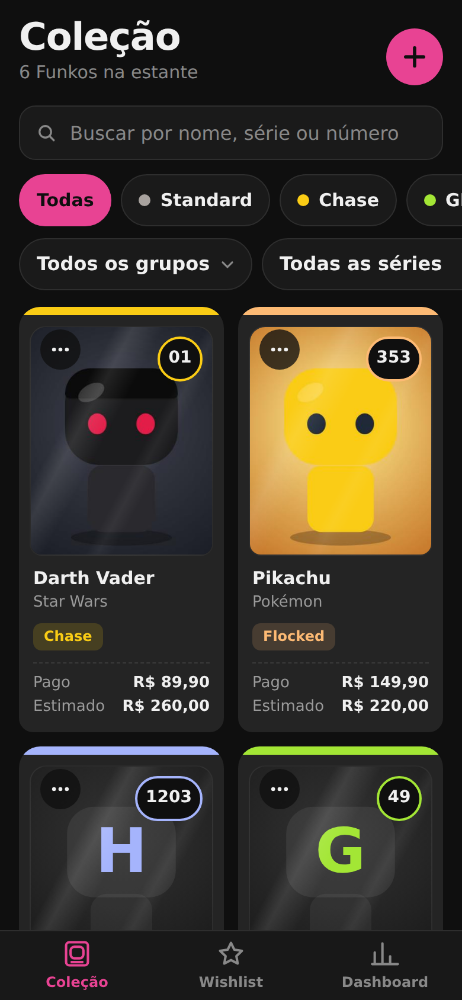
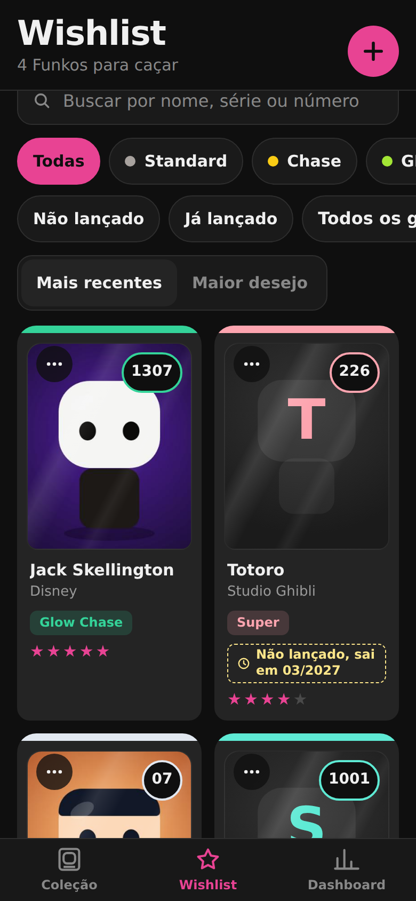
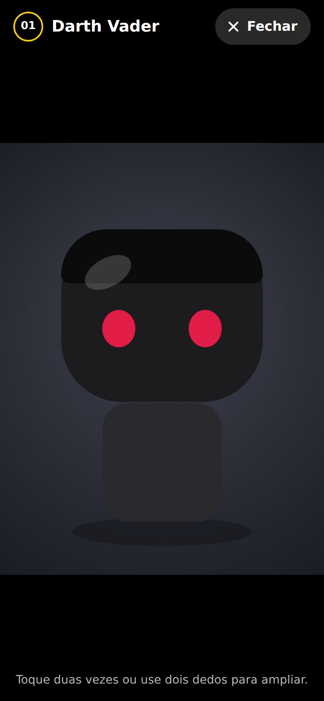
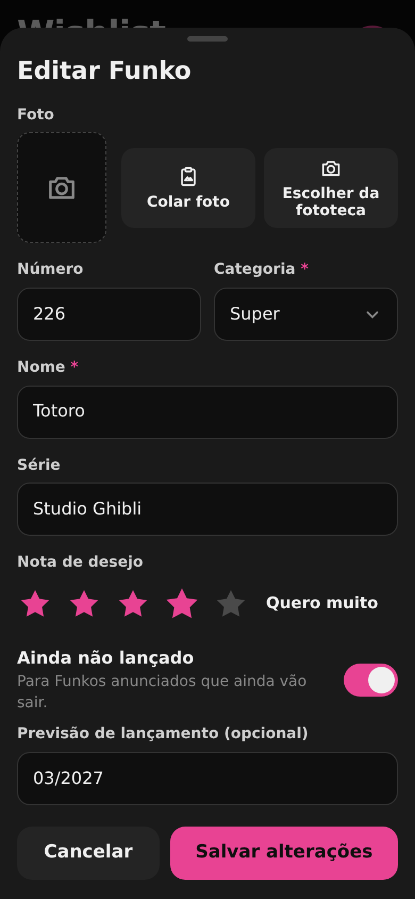
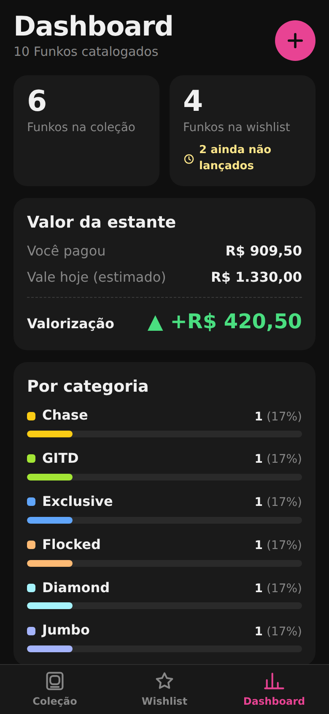
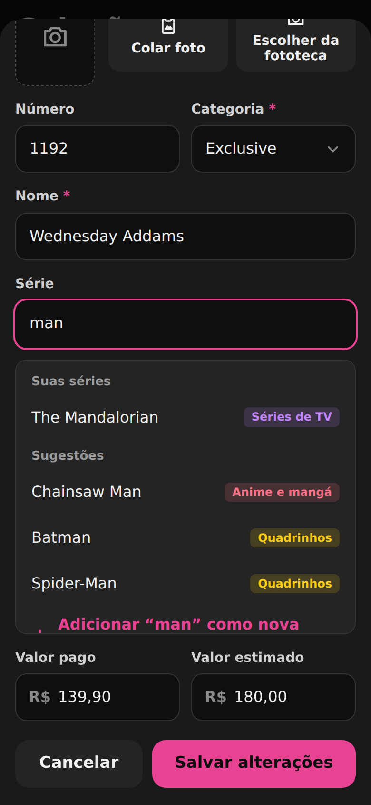

<p align="center">
  
</p>

<h1 align="center">Funko Tracker</h1>

<p align="center">
  Catálogo de Funko Pops para iPhone: coleção, wishlist e valor da estante, tudo offline.<br>
  <a href="https://gustavoblopes79.github.io/funko-tracker/"><strong>Abrir o app</strong></a>
</p>

<p align="center">
  
  &nbsp;
  
  &nbsp;
  
  &nbsp;
  
  &nbsp;
  
  &nbsp;
  
</p>

## O que o app faz

- **Coleção:** cada Funko vira um card no formato da caixa do Pop, com foto, número, série, categoria e quanto você pagou e quanto ele vale.
- **Wishlist:** anote os Funkos que você quer e dê uma nota de desejo de 1 a 5 estrelas. Ordene por “Maior desejo” para ver primeiro o que você mais quer. Marque os que **ainda não foram lançados**, com a previsão de lançamento. Quando comprar, mova para a coleção e informe o valor pago.
- **Foto em tamanho grande:** toque na foto do card para ver o Funko em tela cheia, com zoom de pinça e toque duplo. Veja [Ver a foto em tamanho grande](#ver-a-foto-em-tamanho-grande).
- **Séries e grupos:** o app lembra as séries que você usa, sugere ao digitar e organiza tudo em grupos (anime e mangá, filmes, séries de TV, games e outros). Veja mais em [Séries e grupos](#séries-e-grupos).
- **Busca e filtros:** encontre pelo nome, pela série ou pelo número, filtre por categoria (Chase, GITD, Flocked, Diamond, Jumbo, Super, Plus e outras), por grupo e por série, separe na wishlist o que já foi lançado do que ainda vai sair, ou agrupe a lista por série.
- **Dashboard:** total pago, valor estimado, valorização da estante, quantos itens da wishlist ainda não foram lançados, quantos Funkos você tem por categoria, por grupo e por série, e quanto espaço o app usa no aparelho.
- **Fotos:** cole uma foto copiada ou escolha da fototeca. As fotos ficam num banco próprio do navegador, com espaço para centenas delas. Veja [Como adicionar fotos](#como-adicionar-fotos) e [Fotos e armazenamento](#fotos-e-armazenamento).
- **Backup:** exporte um arquivo JSON pelo menu de compartilhar do iPhone e importe quando precisar.
- **Funciona offline** depois da primeira abertura, sem login e sem servidor. Os dados ficam só no seu aparelho.

Feito com HTML, CSS e JavaScript puro, sem frameworks e sem bibliotecas externas. Todos os caminhos são relativos (`./`), então o app funciona em subpastas, como `usuario.github.io/funko-tracker/`.

## Como adicionar fotos

No formulário do Funko, o campo **Foto** tem duas opções:

- **Escolher da fototeca:** abre a fototeca ou a câmera do iPhone.
- **Colar foto:** usa a imagem que você copiou em outro app, como Safari, Instagram ou Fotos (toque e segure a imagem e escolha **Copiar**).

Também dá para colar direto, com o formulário aberto:

- **No computador:** aperte **⌘V** (Mac) ou **Ctrl+V** (Windows).
- **No iPhone, se o Safari não liberar o botão Colar foto:** o app mostra uma área rosa. Toque e segure nela e escolha **Colar**.

Se não houver imagem copiada, o app avisa: “Não há imagem copiada. Copie uma foto e tente de novo.” Toda foto, colada ou escolhida, passa pelo mesmo ajuste: no máximo 800 px no maior lado, em JPEG.

## Ver a foto em tamanho grande

- **Abrir:** toque na foto do card, na coleção ou na wishlist, ou na prévia da foto no formulário de edição. A foto abre em tela cheia, inteira, sem cortes, com o nome e o número do Funko.
- **Ampliar:** use dois dedos (pinça) ou toque duas vezes, de 1× até 4×. Com a foto ampliada, arraste para ver os detalhes. Toque duas vezes de novo para voltar ao tamanho normal.
- **Fechar:** toque em **Fechar**, toque no fundo escuro, arraste a foto para baixo ou aperte **Esc** no teclado.

O toque longo no card e o botão **⋯** continuam abrindo o menu de ações. Card sem foto continua abrindo a edição.

## Fotos e armazenamento

- **Onde ficam:** as fotos ficam no **IndexedDB**, um banco do próprio navegador com bem mais espaço que o `localStorage`, que guarda só os textos e números, poucos KB. Nos testes, 150 Funkos com foto ocuparam cerca de 26 MB sem nenhum aviso de falta de espaço.
- **Tamanho:** fotos novas são salvas com até 1200 px no maior lado, em JPEG com qualidade 0,8. Os cards usam uma miniatura leve, gerada pelo app, e a foto inteira só é lida quando você abre o visualizador.
- **Proteção:** o app pede ao navegador para não apagar os dados por falta de uso (`navigator.storage.persist()`). O Safari pode recusar o pedido; nesse caso, o backup continua sendo a sua garantia.
- **Espaço usado:** o Dashboard mostra quanto o app ocupa no aparelho, perto do botão de backup.
- **Mudança de versão:** na primeira abertura desta versão, o app move as fotos que estavam no `localStorage` para o IndexedDB. Cada foto só sai do `localStorage` depois de gravada e conferida no IndexedDB. Se algo falhar no meio, nada se perde: o app continua abrindo e termina a mudança na próxima vez.
- **Sem o banco de fotos:** em alguns modos de navegação privada o navegador bloqueia o IndexedDB. Aí o app avisa uma vez e volta a guardar as fotos no `localStorage`, com o limite antigo de cerca de 5 MB.

## Séries e grupos

- **Sugestões ao digitar:** no campo **Série**, a lista mostra primeiro as séries que você já usa (as mais usadas no topo) e depois as sugestões do catálogo do app, com cerca de 70 séries populares, como Naruto, One Piece, Star Wars, Harry Potter, Stranger Things e Super Mario.
- **Série nova:** se o nome não existir, toque em **Adicionar “nome” como nova série** e escolha o grupo. Se não escolher, ela entra em **Outros**.
- **Sem duplicatas:** maiúsculas, acentos e espaços extras não criam série repetida. “boku no hero” e “Boku no Hero” são a mesma série.
- **Grupos:** Anime e mangá, Filmes, Séries de TV, Games, Quadrinhos, Desenhos, Música, Esportes e Outros.
- **Gerenciar séries:** em **Dashboard → Por série → Gerenciar séries**, você pode:
  - renomear (os Funkos que usam a série são atualizados na coleção e na wishlist);
  - mudar de grupo;
  - mesclar duas séries;
  - excluir uma série que nenhum Funko usa.
- **Nas listas:** filtre por grupo e por série, ou toque em **Agrupar por série** para ver os Funkos separados em seções.

Na primeira vez que esta versão abre, o app monta o registro de séries a partir das séries que seus Funkos já têm, sem mudar nenhum Funko. Séries conhecidas do catálogo herdam o grupo certo; as outras entram em **Outros**.

## Categorias

Standard, Chase, GITD, Glow Chase, Exclusive, Limited, Flocked, Metallic, Diamond, Chrome e as de tamanho: **Jumbo**, **Super** e **Plus**.

Cada Funko tem uma categoria só. Se ele se encaixa em duas, como um “Jumbo Chase”, cadastre na que você considera principal e, se quiser, escreva o resto no nome (por exemplo, “Hulk (Chase)”).

## Arquivos

```
funko-tracker/
├── index.html              app completo (CSS e JS embutidos)
├── manifest.json           nome, cores e ícones do app instalado
├── service-worker.js       cache offline (cache-first)
├── README.md
├── docs/                   capturas de tela usadas neste README
├── tools/gerar-icones.js   gera os PNGs dos ícones (Node, sem dependências)
└── icons/
    ├── icon-192.png
    ├── icon-512.png
    └── apple-touch-icon.png
```

Para refazer os ícones depois de mudar o desenho ou as cores no script:

```bash
node tools/gerar-icones.js
```

## 1. Rodar localmente no VS Code

O service worker só funciona por `http://localhost` ou `https://`. Abrir o `index.html` direto (`file://`) não ativa o modo offline.

**Opção A: extensão Live Server**
1. Instale a extensão **Live Server** (Ritwick Dey) no VS Code.
2. Abra a pasta `funko-tracker`.
3. Clique com o botão direito em `index.html` → **Open with Live Server**.

**Opção B: Python**
```bash
cd funko-tracker
python3 -m http.server 8080
```
Acesse `http://localhost:8080/`.

Para testar no iPhone pela rede de casa, use o IP do computador (`http://192.168.x.x:8080/`). Por HTTP sem localhost o Safari não registra o service worker, então o modo offline só vale depois de publicar no GitHub Pages.

## 2. Publicar no GitHub Pages

1. No GitHub, crie um repositório **público** chamado `funko-tracker`, sem README.
2. No terminal, dentro da pasta `funko-tracker`:
   ```bash
   git init
   git add .
   git commit -m "Funko Tracker"
   git branch -M main
   git remote add origin https://github.com/gustavoblopes79/funko-tracker.git
   git push -u origin main
   ```
3. No repositório, abra **Settings → Pages**.
4. Em **Build and deployment**, escolha **Source: Deploy from a branch**, branch **main** e pasta **/ (root)**. Clique em **Save**.
5. Espere de 1 a 2 minutos e acesse `https://gustavoblopes79.github.io/funko-tracker/`.

## 3. Instalar no iPhone

1. Abra o link no **Safari**. Outros navegadores do iOS não instalam PWAs da mesma forma.
2. Toque em **Compartilhar** (o quadrado com a seta para cima).
3. Role e toque em **Adicionar à Tela de Início**.
4. Confirme o nome **Funko** e toque em **Adicionar**.

O app abre em tela cheia, sem a barra do Safari. Depois da primeira abertura, ele funciona sem internet.

## 4. Atualizar o app depois

O service worker guarda os arquivos em cache. Para o iPhone baixar uma versão nova:

1. Altere os arquivos.
2. Em `service-worker.js`, aumente a versão do cache:
   ```js
   const CACHE_NAME = 'funko-v6'; // era funko-v5
   ```
3. Se criar arquivos novos, inclua cada um na lista `ARQUIVOS` do mesmo arquivo, sempre com `./` na frente.
4. Faça commit e push.
5. No iPhone, abra o app, feche-o pelo seletor de apps e abra de novo. A versão nova entra na segunda abertura.

Os dados da coleção não são apagados na atualização: eles ficam no `localStorage` e no IndexedDB, separados do cache.

**Exporte um backup antes de atualizar o app no iPhone**, principalmente quando a versão nova mexe no armazenamento, como esta, que muda as fotos de lugar.

## 5. Faça backup

O Safari pode **apagar o armazenamento de sites e apps da Tela de Início que ficam sem uso** por algumas semanas. Apagar o app da Tela de Início, limpar os dados do Safari ou trocar de iPhone também apaga a coleção.

Para não perder nada:

1. Abra a aba **Dashboard**.
2. Toque em **Exportar backup (JSON)**.
3. No menu de compartilhar, escolha **Salvar em Arquivos** e guarde no **iCloud Drive**.

Para restaurar, toque em **Importar backup** e escolha o arquivo `.json`. O app mostra quantos Funkos e séries o backup tem e pede confirmação antes de substituir os dados atuais.

### Formato do backup

O arquivo é um JSON na **versão 2**, com:

- `colecao` e `wishlist`: os Funkos, cada um com a **foto dentro do arquivo** (`foto`, em base64). O backup é autossuficiente: não depende do aparelho em que foi feito.
- os campos `naoLancado` e `lancamento` nos itens da wishlist;
- `series`: o registro de séries com os grupos.

Backups antigos continuam funcionando:

- **versão 1:** sem séries; o app monta as séries a partir dos Funkos;
- **versão 2 sem os campos de lançamento:** os itens contam como já lançados.

Na importação, as fotos vão para o IndexedDB e as fotos dos Funkos substituídos são apagadas. Com muitas fotos, o arquivo fica grande: cada foto ocupa de 150 a 350 KB dentro dele. Se o Safari demorar para preparar o arquivo, ele mostra um botão **Compartilhar backup** para você escolher onde salvar.
